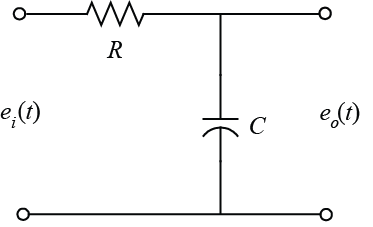

# MATLAB MNA

Modified Nodal Analysis by using MATLAB

This program gets an electrical circuit netlist like HSPICE and gives you the Bode (Frequency Response) Plot using Modified Nodal Analysis in MATLAB.

## Getting Started

To run the program, first open MATLAB and add to path the **`src`** folder and its subfolders.

Open **`Main.m`** and assign your netlist file name to the **`file`** variable.


### Tips

The netlist file is similar to HSPICE, but there are some minor differences:
*	Don’t write **`ac`** for independent voltage sources. (Only **ac** independent voltage sources are supported by this program, so there is no need to mention.)
*	Also don’t mention **`ac`** for the method of analysis.
*	You must determine the **input** and **output** **nodes** of the circuit for computing the frequency response.
*	You don’t need to write **`.end`** in the last line of the netlist file.
*	Only **integer numbers** are allowed to define **nodes**.
* Only these components are supported:
  * **`R`** (Resistor)
  * **`C`** (Capacitor)
  * **`L`** (Inductor)
  * **`V`** (Voltage Source)
  * **`I`** (Current Source)
  * **`E`** (Voltage Controlled Voltage Source)
  * **`G`** (Voltage Controlled Current Source)

* Use the following format to define necessary fields for analysis plot:
```
.    <min-frequency>    <max-frequency>    <input-node>    <output-node>
```

## Netlist Example



```text
***Example-1

Vin	1	0	1
R1	1   	2	10k
C1	2	0	100u

.	0.01	100	1	2
```

## Author
**Rabist** - view on [LinkedIn](https://www.linkedin.com/in/rabist)

## Details
- **Course:** Electrical Circuits - Undergraduate
- **Teacher:** [Dr. Sayed Alireza Sadrossadat](https://yazd.ac.ir/en/people/sadr)
- **Univ:** Yazd University
- **Semester:** Fall 1398

## License
Licensed under [MIT](LICENSE).
